# Cosarc - Dynamic Web Application & CI/CD Pipeline

> **CCA 2 Assessment Submission — Cloud Computing and DevOps (CSE30040)**  
> **MIT World Peace University, Pune** | Department of Computer Engineering and Technology  
> **Faculty:** Pranati Waghodekar  

---

## 📌 Project Information

| Field | Student Details |
| :--- | :--- |
| **Project Title** | Cosarc - Cinematic Fitness & Discipline Portal |
| **Technology Stack** | Node.js (v24), Express, EJS, ESLint, node:test, Docker, GitHub Actions, Render |
| **CI/CD Pipeline** | Automated Linting $\rightarrow$ Unit/Integration Testing $\rightarrow$ Docker Build & Smoke Test $\rightarrow$ Render Webhook Deployment |
| **GitHub Repository** | *[Insert your public GitHub repo URL]* |
| **Live Web App URL** | *[Insert your Render Live application URL]* |

---

## 🎯 Overview & Key Features

**Cosarc** is a dynamic web application built for logging and managing daily discipline contracts, fitness targets, hydration protocols, and nutrition plans. Data is dynamically rendered by the Express server on every request.

### Dynamic Web Features:
- 📊 **Dynamic Statistics Dashboard:** Live calculation of completion rate %, total active contracts, average discipline score, and active commit ID.
- 📝 **Server-Validated Input Form:** Input form with server-side validation rejecting invalid data (e.g. missing required fields or invalid ratings) with HTTP 400 status.
- ⚡ **JSON API Route (`/api/contracts`):** Exposes live contract logs and dynamic statistics in JSON format.
- 🏥 **Health Check Route (`/health`):** Returns container health status `{"status": "ok", "commit": "<sha>"}` for smoke testing.
- 🔖 **Commit Footer Tracking:** Displaying `commit <sha>` in the page footer read directly from `GIT_SHA` or `RENDER_GIT_COMMIT` environment variables.

---

## 🏗️ System Architecture & CI/CD Pipeline

```mermaid
flowchart LR
    A["💻 Git Push to Main"] --> B["🔍 Stage 1: ESLint Check"]
    B --> C["⚡ Stage 2: Automated Tests (node:test)"]
    C --> D["🐳 Stage 3: Docker Build & Smoke Test"]
    D --> E["🚀 Stage 4: Trigger Render Deploy Hook"]
    E --> F["🌐 Live Web App (Render)"]

    style A fill:#12161f,stroke:#00f2fe,color:#fff
    style B fill:#12161f,stroke:#4facfe,color:#fff
    style C fill:#12161f,stroke:#00e676,color:#fff
    style D fill:#12161f,stroke:#ffb703,color:#fff
    style E fill:#12161f,stroke:#00f2fe,color:#fff
    style F fill:#12161f,stroke:#00e676,color:#fff
```



---

## 🚀 Quick Start Guide (Local Development)

### 1. Prerequisites
- Node.js >= 20.x
- Git & Docker Desktop (optional for local container testing)

### 2. Installation
```bash
git clone <your-repository-url>
cd cosarc-web
npm install
```

### 3. Run Quality Gates Locally
```bash
# Run ESLint check
npm run lint

# Run Automated Test Suite (node:test)
npm test
```

### 4. Start Local Server
```bash
npm start
```
Open [http://localhost:3000](http://localhost:3000) in your browser.

---

## 🐳 Docker Containerization

To build and run the production Docker image locally:

```bash
# 1. Build the Docker image with commit SHA argument
docker build --build-arg GIT_SHA=$(git rev-parse --short HEAD) -t cosarc-web .

# 2. Run the container on port 3000
docker run -p 3000:3000 --name cosarc-app cosarc-web

# 3. Test container health
curl -f http://localhost:3000/health
```

---

## ⚙️ CI/CD Deployment Setup (GitHub Actions + Render)

1. **GitHub Repository:** Push your code to a public GitHub repository.
2. **Render Web Service:**
   - Create a new Web Service on Render connected to your GitHub repository.
   - Set **Language:** Node (or Docker).
   - Set **Build Command:** `npm ci`
   - Set **Start Command:** `node server.js`
   - Set **Auto-Deploy:** `OFF` (GitHub Actions will handle deployment).
   - Set **Health Check Path:** `/health`
3. **Deploy Hook Secret Setup:**
   - Copy your **Deploy Hook URL** from Render Service Settings.
   - Go to GitHub Repository $\rightarrow$ **Settings** $\rightarrow$ **Secrets and variables** $\rightarrow$ **Actions**.
   - Create a secret named `RENDER_DEPLOY_HOOK` with the copied URL value.

---

## 💡 Viva Questions & Answers

1. **What is the difference between CI and CD?**
   - **CI (Continuous Integration):** Automates linting, building, and running tests on every push/PR to catch bugs early.
   - **CD (Continuous Deployment):** Automatically releases code that passes all CI checks to live servers without manual steps.
2. **What does the `needs:` keyword do in GitHub Actions?**
   - It enforces sequential execution between jobs. A job with `needs: test` will only execute if the `test` job passes. If tests fail, downstream jobs (like `build` and `deploy`) are skipped.
3. **Why should deploy URLs be stored as secrets?**
   - Storing deploy hook URLs in public code allows unauthorized users to trigger arbitrary releases. Using GitHub Secrets ensures credentials remain private.
4. **Why do we use Docker when the app runs locally?**
   - Docker ensures environment consistency across development, testing, and production by bundling the application with its exact Node.js runtime and dependencies, eliminating "works on my machine" issues.
